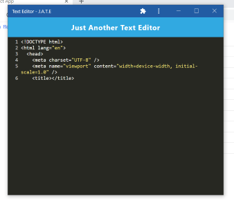
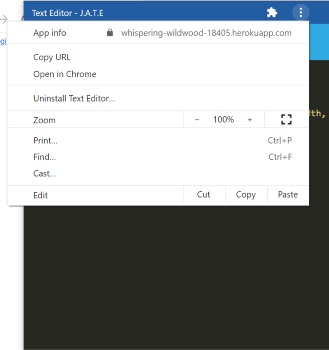

  
  # Task Editor
   

  

  ## Description: 
  Task Editor is a downloadable, progressive web application that allows users to continue working through network interruptions.
  &nbsp;
  &nbsp;

  &nbsp;
  &nbsp;
  ## Table of Contents
  - [Usage](#usage)
  - [License](#license)
  - [Contributing](#contributing)
  - [Questions](#questions)
   

  &nbsp;
  &nbsp;
  Example screenshot:
  

  
  &nbsp;
  &nbsp;

  &nbsp;
  &nbsp;
  ## Usage:
  To download Task Editor, visit [https://whispering-wildwood-18405.herokuapp.com/](https://whispering-wildwood-18405.herokuapp.com/). The application also features its own uninstall, as seen here:
  &nbsp;
  &nbsp;
  
&nbsp;
&nbsp;

  &nbsp;
  &nbsp;

  &nbsp;
  &nbsp;
  ## License:

      This project is licensed under the MIT license.

    
  &nbsp;
  &nbsp;

  ## Contributing:
  If you would like to contribute to this project, please use a fork to push your code to the repo and make a pull request.
  &nbsp;
  &nbsp;
  
  &nbsp;
  &nbsp;
  ## Questions:
  If you have questions about this project, please contact me at [jkanvision@knights.ucf.edu](mailto:jkanvision@knights.ucf.edu). You can view my other projects by visiting my GitHub profile: [https://github.com/jkanvision](https://github.com/jkanvision).